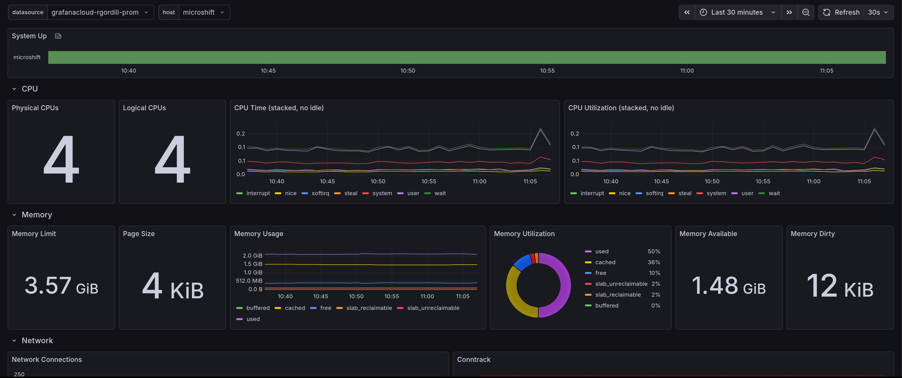

# HostMetrics Receiver

This directory contains resources for the OpenTelemetry Collector's `hostmetrics` receiver, which collects system-level metrics from the host machine.

## Overview

The `hostmetrics` receiver is a core component of the OpenTelemetry Collector that scrapes system metrics from the host operating system. It provides comprehensive monitoring among others of:

- **CPU Metrics**: Utilization, frequency, logical/physical core counts, and time metrics
- **Memory Metrics**: Available memory, usage, utilization, page size, and limits
- **Network Metrics**: Network I/O, packets, connections, errors, and dropped packets
- **Disk Metrics**: Disk I/O, operation time, pending operations, and weighted I/O time
- **Filesystem Metrics**: Filesystem usage, inode usage, and utilization
- **Process Metrics**: Process count and creation metrics
- **System Metrics**: System uptime and other system-level information

## Dashboard Preview



The HostMetrics dashboard provides comprehensive visualization of all system-level metrics collected by the `hostmetrics` receiver. The dashboard is designed to work with OpenTelemetry HostMetrics receiver with optional metrics enabled like suggested in the [config/hostmetrics.yml](config/hostmetrics.yml) file.

## Configuration

### Example Configuration

The `config/hostmetrics.yml` file contains a complete example configuration for the `hostmetrics` receiver with usual recommended scrapers enabled. You can use this file as a starting point for your own configuration.

### Network Interface Exclusions

The configuration excludes virtual network interfaces commonly found in containerized environments:
- `veth.*` - Virtual Ethernet interfaces
- `[a-f0-9]{15}` - Docker container interfaces
- `enP.*` - Virtual network interfaces
- `ovn-k8s-mp[0-9]*` - OVN Kubernetes interfaces
- `br-*` - Bridge interfaces
- `tun[0-9]*` - TUN interfaces
- `cali[a-f0-9]*` - Calico interfaces

### Disk Device Exclusions

The configuration excludes virtual disk devices:
- `sr.*` - CD/DVD drives
- `dm-.*` - Device mapper devices
- `loop.*` - Loop devices
- `fd.*` - Floppy disk devices

## Grafana Dashboard

### Importing the Dashboard

1. Open Grafana and navigate to **Dashboards** → **Import**
2. Upload the JSON file from `grafana/HostMetrics-*.json`
3. Select your Prometheus data source
4. Click **Import**

### Dashboard Features

The dashboard includes panels for:
- System uptime and status
- CPU utilization and frequency across cores
- Memory usage, available, and utilization
- Network I/O, packets, errors, and connections
- Disk I/O, operations, and timing
- Filesystem usage and inode statistics
- Process counts by state

### Prerequisites

- Grafana instance (version 12.3.0 or compatible)
- Prometheus data source configured in Grafana
- OpenTelemetry Collector configured with the `hostmetrics` receiver
- Metrics being exported to your Prometheus-compatible backend

## Metric Comparison with Node Exporter

The `comparative/` directory contains detailed comparisons between Node Exporter metrics and OpenTelemetry HostMetrics metrics. This is useful for:

- **Migration**: Understanding how to migrate from Node Exporter to OpenTelemetry Collector
- **Mapping**: Finding equivalent metrics between the two systems
- **Gaps**: Identifying metrics available in one system but not the other

### Comparison Document

See [comparative/hostmetrics vs node-exporter.md](comparative/hostmetrics%20vs%20node-exporter.md) for a comprehensive comparison covering:

- **CPU Metrics**: 15 metrics compared, including utilization, frequency, and time metrics
- **Memory Metrics**: 28 metrics compared, including usage, limits, and Linux-specific metrics
- **Network Metrics**: 18 metrics compared, including I/O, packets, errors, and OTel-only metrics
- **Disk Metrics**: 23 metrics compared, including I/O operations, timing, and merges
- **Filesystem Metrics**: 7 metrics compared, including size, usage, and inodes
- **Process Metrics**: 8 metrics compared, including state counts and creation metrics

The comparison includes:
- Direct mappings where metrics are equivalent
- Notes on semantic differences
- OTel-only metrics not available in Node Exporter
- Node Exporter-only metrics not available in HostMetrics
- Guidance on how to reconstruct HostMetrics from Node Exporter data

## Usage in OpenTelemetry Collector

### Basic Configuration

```yaml
receivers:
  hostmetrics:
    collection_interval: 10s
    scrapers:
      cpu: {}
      memory: {}
      network: {}
```

### Complete Configuration

For a complete configuration example with all scrapers enabled, see `config/hostmetrics.yml`.

### Integration with Pipelines

```yaml
service:
  pipelines:
    metrics:
      receivers: [hostmetrics]
      processors: [batch]
      exporters: [otlp]
```

## Related Resources

- [OpenTelemetry HostMetrics Receiver Documentation](https://github.com/open-telemetry/opentelemetry-collector-contrib/tree/main/receiver/hostmetricsreceiver)
- [OpenTelemetry Semantic Conventions](https://opentelemetry.io/docs/specs/semconv/system/)
- [Grafana Dashboard Documentation](https://grafana.com/docs/grafana/latest/dashboards/)

## License

This project is licensed under the Apache License 2.0 - see the [LICENSE](../LICENSE) file for details.

